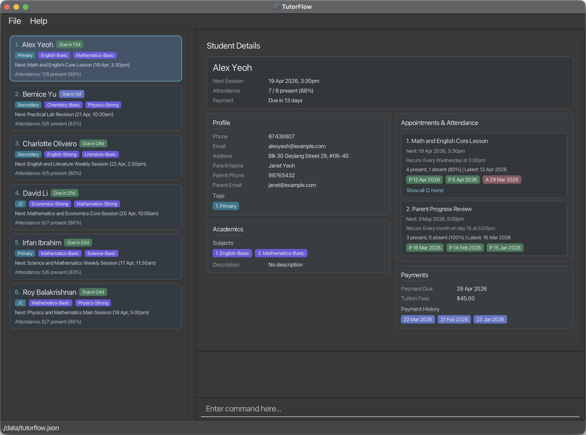
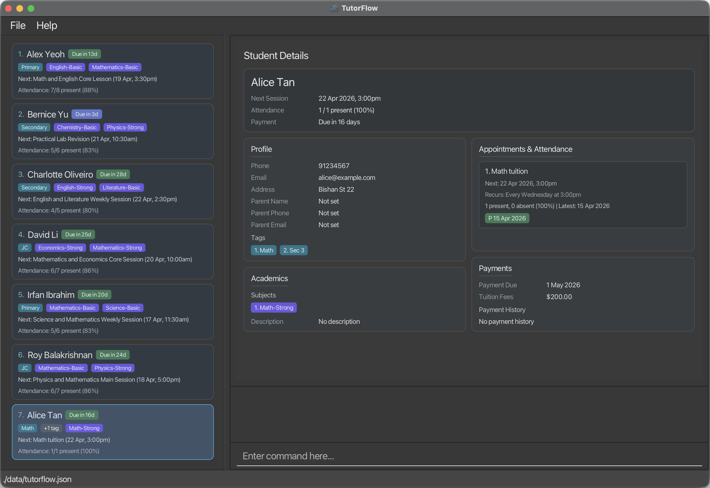
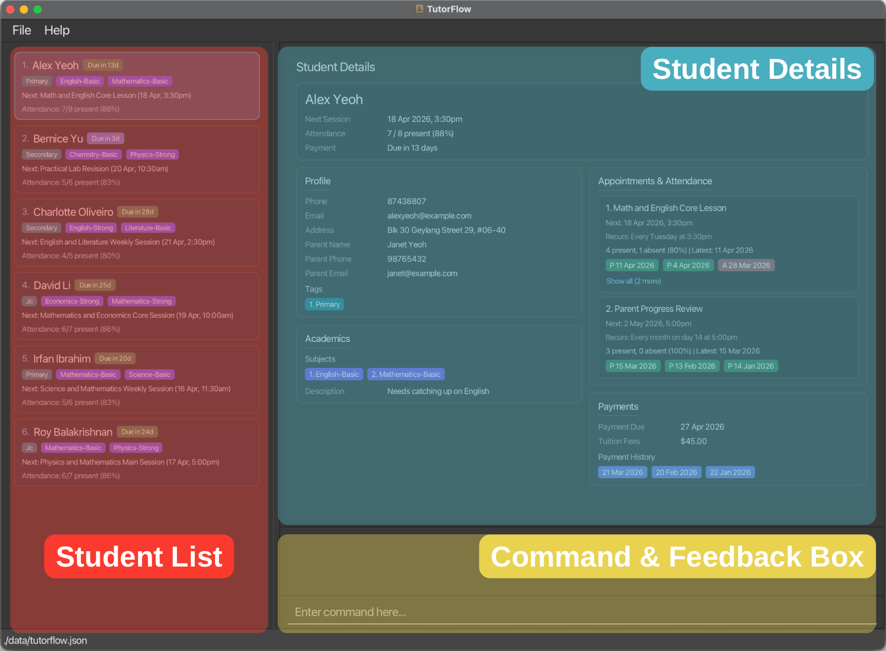

<page-nav-print />

TutorFlow is a **desktop app for freelance private tutors who need to manage students, parents, billing, and lesson schedules in one place**. It is optimized for keyboard-first use, so tutors who are comfortable typing commands can update records faster than with a mouse-only workflow.

Replace scattered spreadsheets, chat messages, and sticky notes with a single, always-consistent student database.

**Key features:**

* Student and parent / guardian contact management
* Subject and proficiency-level tracking
* Recurring lesson scheduling with attendance logging
* Tuition billing with automatic due-date advancement
* Powerful search and filtering across all record types

<box type="info" seamless header="**Who this guide is for**">
<md>

This guide assumes you:

* Are comfortable opening a terminal (Command Prompt on Windows, Terminal on macOS / Linux).
* Can install and run a Java application.
* Prefer typing commands over clicking through menus.

No programming experience is required.

</md>
</box>

--------------------------------------------------------------------------------------------------------------------

## Quick Start / Tutorial

1. Ensure that Java `17` or above is installed on your computer.
   Run `java -version` in your terminal — you should see `java version "17.x.x"` or higher.
   **Mac users:** follow the setup notes [here](https://se-education.org/guides/tutorials/javaInstallationMac.html).

1. Download the latest `tutorflow.jar` from the [releases page](https://github.com/AY2526S2-CS2103T-T09-3/tp/releases).

1. Move the jar file into the folder you want TutorFlow to use as its home folder.

1. Open a terminal, `cd` into that folder, for example, `cd target_directory/tutorflow_app`, and run:

   `java -jar tutorflow.jar`

1. On first launch, or when no existing data file is present, TutorFlow starts with sample data so that you can try the commands immediately. You should see a window similar to the one below, pre-loaded with sample students.

   

   For a detailed overview of TutorFlow's interface panels, see [TutorFlow at a glance](#tutorflow-at-a-glance).

1. Type a command into the command box and press Enter to run it. Try these first:

   * `list` — shows all students.
   * `view 1` — selects the first student and shows their full record.
   * `find student alex` — filters the list to students whose name contains "alex".
   * `help` — opens the help window.
   * `exit` — closes TutorFlow.

1. **Quick tutorial — try this end-to-end workflow:**

   a. Add a student:
      `add student n/Alice Tan p/91234567 e/alice@example.com a/Bishan St 22`

   b. View her record:
      `view 7`

   c. Add tags:
      `add tag 7 t/Sec 3 t/Math`

   d. Add a subject with proficiency level:
      `add acad 7 s/Math l/Strong`

   e. Set up billing:
      `edit billing 7 a/200 d/2026-05-01`

   f. Schedule a weekly lesson:
      `add appt 7 d/2026-04-15T15:00:00 r/WEEKLY dsc/Math tuition`

   g. Record attendance for the lesson:
      `add attd 7 s/1`

   

1. Refer to the [Command Reference](#student-management) sections below for full details.

--------------------------------------------------------------------------------------------------------------------

## TutorFlow at a glance

TutorFlow is organized around three main areas:

* The **student list** panel shows the students in the current view. Any command that uses `INDEX` refers to this displayed list.
* The **student detail** panel shows the selected student's full record, including numbered tags, subjects, and appointments.
* The **command and result** panel is where you type commands, and confirm whether a command succeeded or failed.

<box type="tip" seamless header="**Tip**">
<md>
For commands such as `delete tag`, `delete acad`, `delete appt`, and `add attd`, the sub-item indexes come from the selected student's detail panel. Use `view INDEX` first if you need to see those numbered items clearly.
</md>
</box>

--------------------------------------------------------------------------------------------------------------------

## Guide conventions and behaviour

<box type="info" seamless header="**Command format notes**">
<md>

* Command words and subcommand words are **case insensitive**. For example, `dElEte STUdenT 1` works the same as `delete student 1`. Prefixes such as `n/` and `p/` must still be entered exactly as shown.

* Words in `UPPER_CASE` are values you must supply.
  Example: in `add student n/NAME`, replace `NAME` with an actual name such as `John Doe`.

* Items in square brackets are optional.
  Example: `edit billing INDEX [a/AMOUNT] [d/DATE]`

* Items followed by `...` can be repeated.
  Example: `add tag INDEX t/TAG [t/TAG]...`

* For commands that use prefixes, the order of prefixed fields usually does not matter.
  Example: `p/91234567 n/John Doe` is accepted for commands that expect both fields.

* For `NAME` values in `add student`, `edit student`, and `edit parent`, the value must contain at least one alphabetic character.
  It may use letters, numbers, spaces, apostrophes (`'`), hyphens (`-`), and periods (`.`).

* Whenever a command uses `INDEX`, it must be a positive integer such as `1`, `2`, or `3`.

* Unless stated otherwise, `INDEX` refers to the **currently displayed student list**, which may change after filtering or deleting students.
  Some commands also use sub-item indexes such as `TAG_INDEX`, `SUBJECT_INDEX`, or `APPT_INDEX`; those come from the selected student's detail panel.

* Commands without parameters, such as `help`, `list`, `clear`, and `exit`, ignore extra text after the command word.

* If you are using a PDF version of this guide, be careful when copying multi-line commands. Some PDF viewers may remove spaces around line breaks.

</md>
</box>

<box type="info" seamless header="**Date and timezone behavior**">
<md>

* TutorFlow interprets all `d/` date and date-time inputs using **Singapore time (SGT, UTC+08:00)**.
* Enter date-time values without a timezone offset (for example, use `2026-01-29T08:00:00`, not `2026-01-29T08:00:00Z`).
* Relative checks such as "today", "current date", and "future date/time" are also based on **Singapore time**.

</md>
</box>

<box type="info" seamless header="**How finding works**">
<md>

* `find` commands search within the **currently displayed list**, not always the full student list.
* You can run multiple `find` commands one after another to narrow results step by step.
* Use `list` to reset back to the full student list before searching again.
* For most `find` commands, TutorFlow looks for your search word anywhere in the text and ignores upper/lower case.
  Example: `al` can match `Alex`.
* Date-based `find` commands (`find appt`, `find billing`) search by date or month instead of text.

</md>
</box>

--------------------------------------------------------------------------------------------------------------------

## Student Management

Use these commands to add, update, view, list, find, and remove student records.

### Adding a student : `add student`

Adds a new student to TutorFlow.

Format: `add student n/NAME p/PHONE e/EMAIL a/ADDRESS [t/TAG]...`

#### Details
* `n/`, `p/`, `e/`, and `a/` are required.
* `t/` is optional and can be repeated.
* Phone numbers must be at least 8 digits long (digits only), and there is no support for international numbers.
* TutorFlow treats two students with the same `NAME` and `EMAIL` as duplicates, so such a student cannot be added.
* A student can be created without any tags. You can add tags later with `add tag`.

#### Examples
* `add student n/John Doe p/98765432 e/johnd@example.com a/John street, block 123, #01-01`
* `add student n/Betsy Crowe p/91234567 e/betsycrowe@example.com a/10 Clementi Road t/Upper Sec t/Math`

<box type="info" seamless header="**Expected output**">
<md>
`Added student to TutorFlow: NAME.`
</md>
</box>

### Editing a student : `edit student`

Edits the basic contact details of an existing student.

Format: `edit student INDEX [n/NAME] [p/PHONE] [e/EMAIL] [a/ADDRESS]`

#### Details
* Edits the student at the specified `INDEX`.
* At least one field must be provided.
* Only the fields you provide are updated. Unspecified fields stay unchanged.
* Phone numbers must be at least 8 digits long (digits only), and there is no support for international numbers.
* The edit is rejected if it would make the student have the same `NAME` and `EMAIL` as another student.

#### Examples
* `edit student 1 n/John Doe p/91234567 e/johndoe@example.com`
* `edit student 2 n/Betsy Crowe`

<box type="info" seamless header="**Expected output**">
<md>
`Updated student details: NAME.`
</md>
</box>

### Deleting a student : `delete student`

Deletes the specified student from TutorFlow.

Format: `delete student INDEX`

#### Details
* Deletes the student at the specified `INDEX`.

#### Examples
* `list` followed by `delete student 2` — run `list` first to ensure the index matches the full student list.
* `find student Betsy` followed by `delete student 1` — deletes the first student in the filtered results.

<box type="info" seamless header="**Expected output**">
<md>
`Removed student from TutorFlow: NAME.`
</md>
</box>

### Viewing a student's details : `view`

Selects a student and shows the full record in the detail panel.

Format: `view INDEX`

#### Details
* Use this command when you need to inspect parent details, academics, billing, tags, subjects, appointments, or attendance.
* The detail panel also shows the numbered tag, subject, and appointment indexes used by some other commands.

#### Examples
* `view 1`
* `view 3`

<box type="info" seamless header="**Expected output**">
<md>
`Showing details for student: NAME.`
</md>
</box>

### Listing all students : `list`

Shows the full student list.

Format: `list`

<box type="info" seamless header="**Expected output**">
<md>
`Showing all students in TutorFlow.`
</md>
</box>

### Locating students by name : `find student`

Finds students whose names contain any of the given keywords.

Format: `find student KEYWORD [MORE_KEYWORDS]`

#### Details
* The search is case-insensitive.
  Example: `alex` matches `Alex`
* The order of keywords does not matter.
* Only student names are searched.
* Matching is by substring.
* Example: `Al` matches `Alex`
* A student is returned if the name matches **at least one** keyword.

#### Examples
* `find student John`
* `find student bernice david`

<box type="info" seamless header="**Expected output**">
<md>
`Found N matching student(s).`
</md>
</box>

<box type="tip" seamless header="**Tip**">
<md>
`find` searches only the currently displayed list. Run `list` first to search all students. You can also chain multiple `find` commands to narrow results step by step. [More on finding →](#reading-command-formats)
</md>
</box>

### Common mistakes and recovery

<panel type="seamless" header="Quick fixes">
<markdown>
* **`edit student`, `delete student`, or `view` says the student index is invalid:** Run `list` first, then use the index from the currently displayed list.
* **`find student` does not show someone you expected:** `find` works on the current filtered list. Run `list` to reset, then run `find student` again.
* **Phone number is rejected in `add student` or `edit student`:** Use digits only, at least 8 digits, with no `+`, spaces, or dashes.
* **`add student` says the student already exists:** This usually means another record already has the same `NAME` and `EMAIL`. Use a different email or correct the existing record with `edit student`.
</markdown>
</panel>

--------------------------------------------------------------------------------------------------------------------

## Tag Management

Use tags to group students by level, stream, exam target, or any other label that fits your teaching workflow.

### Adding tags to a student : `add tag`

Adds one or more tags to an existing student.

Format: `add tag INDEX t/TAG [t/TAG]...`

#### Details
* Adds the given tag or tags to the student at `INDEX`.
* At least one `t/` prefix is required.
* Existing tags are kept; tags already present are ignored (case-insensitive).
* Duplicate tag names within the same command are also ignored (case-insensitive).

#### Examples
* `add tag 1 t/JC`
* `add tag 2 t/Upper Sec t/Programming`

<box type="info" seamless header="**Expected output**">
<md>
`Added tags for student: NAME.`
</md>
</box>

<box type="tip" seamless header="**Tip**">
<md>
To add tags without affecting existing ones, use `add tag`. To replace all tags at once, use [`edit tag`](#editing-a-student-s-tags-edit-tag) instead.
</md>
</box>

### Editing a student's tags : `edit tag`

Replaces the student's full tag list.

Format: `edit tag INDEX [t/TAG]...`

#### Details
* All existing tags are replaced by the tags you provide.
* Use exactly one `t/` with no value to clear all tags from that student.
* Using more than one empty `t/`, or mixing an empty `t/` with real tag values, is invalid.

#### Examples
* `edit tag 1 t/JC t/J1`
* `edit tag 2 t/`

<box type="warning" seamless header="**Caution**">
<md>
This command **replaces all existing tags**. To add tags without removing existing ones, use [`add tag`](#adding-tags-to-a-student-add-tag) instead.
</md>
</box>

<box type="info" seamless header="**Expected output**">
<md>
`Replaced tags for student: NAME.`
</md>
</box>

### Deleting tags from a student : `delete tag`

Deletes specific tags from a student by tag index.

Format: `delete tag INDEX t/TAG_INDEX [t/TAG_INDEX]...`

#### Details
* Each `TAG_INDEX` is taken from the numbered tag list in that student's detail panel.
* Tag names keep the user's input casing and are listed in alphabetical order (ignoring upper/lower case).
* At least one `t/` prefix is required.

#### Examples
* `delete tag 1 t/2`
* `delete tag 1 t/1 t/2`

<box type="info" seamless header="**Expected output**">
<md>
`Removed tag(s): TAG_NAME(S).`
</md>
</box>

### Locating students by tag : `find tag`

Finds students whose tags match any of the given tag keywords.

Format: `find tag t/TAG [t/TAG]...`

#### Details
* At least one `t/` prefix is required.
* Multiple `t/` prefixes are allowed.
* Tag matching is case-insensitive.
* Tag matching is partial.
  Example: `t/math` matches the tag `Mathematics`
* A student is returned if any tag matches at least one keyword.

#### Examples
* `find tag t/JC`
* `find tag t/Upper t/Programming`

<box type="info" seamless header="**Expected output**">
<md>
`Found N matching student(s).`
</md>
</box>

### Common mistakes and recovery

<panel type="seamless" header="Quick fixes">
<markdown>
* **`add tag`, `delete tag`, or `find tag` fails even though the command looks close:** Check that each tag input uses `t/`.
* **`delete tag` removes the wrong tag or says index is invalid:** Use `view INDEX` first and take `TAG_INDEX` from that selected student's tag list.
* **`edit tag` with `t/` behaves differently from expected:** Use `edit tag INDEX t/` to clear all tags. Do not mix an empty `t/` with normal tag values.
</markdown>
</panel>

--------------------------------------------------------------------------------------------------------------------

## Academic Management

Use academic records to keep track of the subjects a student takes and any overall academic notes.

### Adding subjects to a student : `add acad`

Adds one or more subjects to a student's academic record. If a subject name already exists, that entry is updated with the new values.

Format: `add acad INDEX s/SUBJECT [l/LEVEL] [s/SUBJECT [l/LEVEL]]...`

#### Details
* At least one `s/` prefix is required.
* `l/LEVEL` is optional and applies to the subject immediately before it.
* Accepted levels are `basic` and `strong` (case-insensitive).
* Existing subjects not named in the command are kept unchanged.
* If the student already has a subject with the same name (case-insensitive), that subject is replaced by the new entry.
* If the replacement is identical to the existing entry, there is no visible change.
* Duplicate subject names within the same command are invalid (case-insensitive).

#### Examples
* `add acad 1 s/Math l/Strong`
* `add acad 1 s/Math l/Strong s/Science`

<box type="info" seamless header="**Expected output**">
<md>
`Added academic subjects for student: NAME.`
</md>
</box>

### Editing a student's academics : `edit acad`

Overwrites the student's subject list and/or updates the overall academic note.

Format: `edit acad INDEX [s/SUBJECT [l/LEVEL]]... [dsc/DESCRIPTION]`

#### Details
* At least one of `s/` or `dsc/` must be provided.
* Accepted levels are `basic` and `strong` (case-insensitive).
* Use `s/` with no value to clear all subjects.
* Use `dsc/` with no value to clear the academic description.
* Only one `dsc/` field is allowed per command.
* Duplicate subject names within the same command are invalid (case-insensitive).

#### Examples
* `edit acad 1 s/Math l/Strong s/Science`
* `edit acad 1 dsc/Good progress this semester`
* `edit acad 2 s/Physics l/Basic dsc/Needs extra support`
* `edit acad 3 s/`

<box type="warning" seamless header="**Caution**">
<md>
When `s/` subjects are provided, this command **replaces the entire subject list**. To add subjects without removing existing ones, use [`add acad`](#adding-subjects-to-a-student-add-acad) instead.
</md>
</box>

<box type="info" seamless header="**Expected output**">
<md>
`Updated academics for student: NAME.`
</md>
</box>

See also: [Adding subjects](#adding-subjects-to-a-student-add-acad)

### Deleting subjects from a student : `delete acad`

Deletes specific subjects from a student by subject index.

Format: `delete acad INDEX s/SUBJECT_INDEX [s/SUBJECT_INDEX]...`

#### Details
* Each `SUBJECT_INDEX` is taken from the numbered subject list in that student's detail panel.
* Subject names keep the user's input casing and are listed in alphabetical order (ignoring upper/lower case).
* At least one `s/` prefix is required.

#### Examples
* `delete acad 1 s/2`
* `delete acad 1 s/2 s/4`

<box type="info" seamless header="**Expected output**">
<md>
`Removed subject(s): SUBJECT_NAME(S).`
</md>
</box>

### Locating students by subject : `find acad`

Finds students whose subjects match any of the given subject keywords.

Format: `find acad s/SUBJECT [s/SUBJECT]...`

#### Details
* At least one `s/` prefix is required.
* Multiple `s/` prefixes are allowed.
* Matching is case-insensitive.
* Matching is partial.
  Example: `s/math` matches `Mathematics`
* A student is returned if any subject matches at least one keyword.

#### Examples
* `find acad s/Math`
* `find acad s/Math s/Science`

<box type="info" seamless header="**Expected output**">
<md>
`Found N matching student(s).`
</md>
</box>

### Common mistakes and recovery

<panel type="seamless" header="Quick fixes">
<markdown>
* **`add acad` or `edit acad` fails because of `l/LEVEL`:** `l/` must come after the subject it belongs to, and level must be `basic` or `strong`.
* **`add acad` or `edit acad` rejects duplicate subjects:** In one command, each subject name can appear only once.
* **`delete acad` says subject index is invalid:** Run `view INDEX` first and use the numbered `SUBJECT_INDEX` shown for that student.
* **Need to clear academics:** Use `edit acad INDEX s/` to clear all subjects. Use `dsc/` with no value to clear the academic description.
</markdown>
</panel>

--------------------------------------------------------------------------------------------------------------------

## Parent / Guardian Management

Use these commands to store and search for the parent or guardian details linked to each student.

### Editing parent details : `edit parent`

Sets or updates parent / guardian details for a student.

Format: `edit parent INDEX [n/PARENT_NAME] [p/PARENT_PHONE] [e/PARENT_EMAIL]`

#### Details
* At least one field must be provided.
* Phone numbers must be at least 8 digits long (digits only), and there is no support for international numbers.
* Existing parent fields stay unchanged unless you replace them.
* If the student does not already have a parent / guardian record, include `n/PARENT_NAME` so TutorFlow can create one.

#### Examples
* `edit parent 3 n/John Lim p/91234567 e/johnlim@example.com`
* `edit parent 1 p/81234567`

<box type="info" seamless header="**Expected output**">
<md>
`Updated parent/guardian details for student: NAME.`
</md>
</box>

### Locating students by parent : `find parent`

Finds students whose parent / guardian details match the supplied keywords.

Format: `find parent [n/NAME_KEYWORDS] [p/PHONE_KEYWORDS] [e/EMAIL_KEYWORDS]`

#### Details
* At least one of `n/`, `p/`, or `e/` must be provided.
* Each prefix may be used at most once.
* You can give multiple keywords inside a single prefix by separating them with spaces.
  Example: `n/Susan Meier`
* Parent name, phone, and email matching are case-insensitive and based on partial text.
* Within a single field, multiple keywords behave as an `OR` search.
  Example: `n/Susan Meier` matches a parent name containing either `Susan` or `Meier`.
* If you supply more than one field, the student is returned if **any supplied field** matches.
  Example: `n/Susan p/9999` matches if the parent name matches `Susan` or the phone matches `9999`.

#### Examples
* `find parent n/Susan`
* `find parent n/Susan p/9999`
* `find parent e/example.com`

<box type="info" seamless header="**Expected output**">
<md>
`Found N matching student(s).`
</md>
</box>

### Common mistakes and recovery

<panel type="seamless" header="Quick fixes">
<markdown>
* **`edit parent` fails when adding parent phone/email for the first time:** If the student has no parent record yet, include `n/PARENT_NAME` in the same command.
* **Parent phone or email is rejected:** Phone must be digits only and at least 8 digits. Email must be in a valid email format.
* **`find parent` results are unexpected:** Use one prefix once (`n/`, `p/`, or `e/`) and put multiple words inside that one prefix, for example `n/Susan Meier`.
* **`find parent n/... p/...` seems too broad:** When multiple fields are provided, TutorFlow returns students matching any provided field.
</markdown>
</panel>

--------------------------------------------------------------------------------------------------------------------

## Billing & Payment Management

Use billing commands to track tuition fees, next payment due dates, and payment history.

### Editing billing details : `edit billing`

Updates a student's tuition fee amount and/or payment due date.

Format: `edit billing INDEX [a/AMOUNT] [d/DATE]`

#### Details
* At least one of `a/` or `d/` must be provided.
* `a/AMOUNT` must be a non-negative number. TutorFlow does not attach a currency to billing amounts — the number you enter is stored and displayed as-is.
* Amounts are displayed to 2 decimal places in the UI. If you enter more decimal places,
  the displayed value is rounded to 2 decimal places.
* `d/DATE` must be in the format `YYYY-MM-DD` (e.g., `2026-03-20`).
* This command changes billing settings only. It does not add a payment record.

#### Examples
* `edit billing 1 a/250`
* `edit billing 1 d/2026-03-20`
* `edit billing 1 a/250 d/2026-03-20`

<box type="info" seamless header="**Expected output**">
<md>
Depending on which fields you update, TutorFlow shows one of:
* `Updated tuition fee for NAME from $OLD to $NEW.`
* `Updated payment due date for NAME from OLD_DATE to NEW_DATE.`
* `Updated billing for NAME: tuition fee $OLD -> $NEW, payment due date OLD_DATE -> NEW_DATE.`
</md>
</box>

### Recording a payment : `add payment`

Records that a student paid on a specific date.

Format: `add payment INDEX d/DATE`

#### Details
* `d/DATE` must be in the format `YYYY-MM-DD`.
* The payment date cannot be later than today.
* Each payment date can be recorded only once per student; adding the same date again is rejected as a duplicate.
* Recording a payment advances the student's billing due date by one billing cycle **only if** the new payment date is later than the most recent recorded payment.
* A billing cycle is one recurrence cycle (monthly by default).
* If you add an older (backfilled) payment date, TutorFlow records it but keeps the due date unchanged.

#### Examples
* `add payment 1 d/2026-03-05`

<box type="info" seamless header="**Expected output**">
<md>
`Recorded tuition payment of $AMOUNT for NAME on DATE.` followed by a billing due-date update message.
</md>
</box>

<box type="tip" seamless header="**Tip**">
<md>
TutorFlow uses the billing amount set via `edit billing` for all payment cycles. Make sure billing is configured before recording payments.
</md>
</box>

See also: [Edit billing](#editing-billing-details-edit-billing)

### Deleting a payment record : `delete payment`

Deletes a previously recorded payment date.

Format: `delete payment INDEX d/DATE`

#### Details
* `d/DATE` must be in the format `YYYY-MM-DD`.
* The date cannot be later than today.
* The specified date must already exist in that student's payment history.
* If you delete the most recent recorded payment date, TutorFlow rolls the due date back by one billing cycle.
* A billing cycle is one recurrence cycle (monthly by default).
* If you delete an older payment date, the due date stays unchanged.

#### Examples
* `delete payment 1 d/2026-03-01`
* `delete payment 2 d/2025-12-15`

<box type="info" seamless header="**Expected output**">
<md>
`Deleted payment date DATE for NAME.`
</md>
</box>

See also: [Add payment](#recording-a-payment-add-payment)

### Finding students by payment due month : `find billing`

Finds students in the current list whose payment due date falls in a given month.

Format: `find billing d/YYYY-MM`

#### Details
* Exactly one `d/` prefix must be provided.
* `YYYY-MM` must be a valid year-month such as `2026-03`.
* Matching ignores the day of the month.

#### Examples
* `find billing d/2026-03`
* `find billing d/2025-12`

<box type="info" seamless header="**Expected output**">
<md>
`Found N matching student(s).`
</md>
</box>

### Common mistakes and recovery

<panel type="seamless" header="Quick fixes">
<markdown>
* **Date input is rejected in billing or payment commands:** Use `YYYY-MM-DD` for `edit billing`, `add payment`, and `delete payment`.
* **`find billing` date is rejected:** Use `d/YYYY-MM` (year and month only, no day).
* **`add payment` does not move due date forward:** The due date advances only when the new payment date is later than the latest recorded payment date.
* **`delete payment` does not roll due date back:** Only deleting the latest recorded payment date rolls due date back by one billing cycle.
</markdown>
</panel>

--------------------------------------------------------------------------------------------------------------------

## Appointment & Attendance Management

In TutorFlow, an **appointment** is a scheduled lesson entry. Each appointment may have one or more **sessions** (individual occurrences). Commands use `SESSION_INDEX` to refer to a specific session within a student's appointment list.

Use these commands to schedule lessons, see weekly appointments, and record whether a lesson happened.

### Adding an appointment : `add appt`

Adds an appointment to a student.

Format: `add appt INDEX d/DATETIME [r/RECURRENCE] dsc/DESCRIPTION`

#### Details
* `d/DATETIME` must be in the format `YYYY-MM-DDTHH:MM:SS` (e.g., `2026-01-29T08:00:00` for 29 Jan 2026, 8:00 AM).
* `r/RECURRENCE` is optional. Valid values are `NONE`, `WEEKLY`, `BIWEEKLY`, and `MONTHLY`.
* If `r/` is omitted, TutorFlow uses `NONE`.
* `dsc/` is required and should describe the session.

#### Examples
* `add appt 1 d/2026-01-29T08:00:00 dsc/Weekly algebra practice`
* `add appt 2 d/2026-02-02T15:30:00 r/WEEKLY dsc/Physics consultation`

<box type="info" seamless header="**Expected output**">
<md>
`Added appointment session for NAME at DATE_TIME.`
</md>
</box>

### Deleting an appointment : `delete appt`

Deletes one or more sessions from a student.

Format: `delete appt INDEX s/SESSION_INDEX [s/SESSION_INDEX]...`

#### Details
* Deletes one or more sessions from the student at `INDEX`.
* `SESSION_INDEX` refers to the numbered session shown for that student in the app. **Note:** `s/` stands for **session index** here, not subject.
* At least one `s/` prefix must be provided.
* All specified session indices must be valid.

#### Examples
* `delete appt 1 s/1`
* `delete appt 2 s/1 s/3`

<box type="info" seamless header="**Expected output**">
<md>
`Removed appointment session(s) for NAME: SESSION_DETAILS.`
</md>
</box>

### Editing an appointment : `edit appt`

Edits a selected session for an existing student.

Format: `edit appt INDEX s/SESSION_INDEX [d/DATETIME] [r/RECURRENCE] [dsc/DESCRIPTION]`

#### Details
* Edits the selected session for the student at `INDEX`.
* `SESSION_INDEX` refers to the numbered session shown for that student in the app.
* At least one of `d/`, `r/`, or `dsc/` must be provided.
* `d/DATETIME` must be in date-time format `YYYY-MM-DDTHH:MM:SS`.
* `r/RECURRENCE` supports `NONE`, `WEEKLY`, `BIWEEKLY`, and `MONTHLY`.
* `dsc/DESCRIPTION` updates the session description.
* Any field you omit remains unchanged.

#### Examples
* `edit appt 1 s/2 d/2026-02-12T09:00:00`
* `edit appt 1 s/2 r/MONTHLY dsc/Physics consultation`

<box type="info" seamless header="**Expected output**">
<md>
`Updated appointment session for NAME to NEW_SESSION_DETAILS.`
</md>
</box>

### Finding students with appointments for a week : `find appt`

Shows students whose next appointment falls within the Monday-to-Sunday week containing the given date.

Format: `find appt [d/DATE]`

#### Details
* If `d/DATE` is omitted, TutorFlow uses the current date (SGT) and searches that date's Monday-to-Sunday week.
* `DATE` must be in the format `YYYY-MM-DD`.

#### Examples
* `find appt`
* `find appt d/2026-04-13`

<box type="info" seamless header="**Expected output**">
<md>
`Found N student(s) with sessions in week MONDAY to SUNDAY.`
</md>
</box>

### Recording appointment attendance : `add attd`

Records attendance for a specific session.

Format: `add attd INDEX s/SESSION_INDEX [STATUS] [d/DATE_OR_DATE_TIME]`

#### Details
* Records attendance for the student at `INDEX`.
* `SESSION_INDEX` refers to the numbered session shown for that student in the app.
* `STATUS` is optional and must be typed as a literal `y` (attended) or `n` (absent).
* If `STATUS` is omitted, `y` (attended) is assumed.
* `y` records that the student attended the selected session.
* `n` records that the student was absent for the selected session.
* If `d/DATE_OR_DATE_TIME` is omitted, the selected session's `next` date is used.
* `d/DATE_OR_DATE_TIME` can be used with both `y` and `n`.
* `d/DATE_OR_DATE_TIME` must be in date (`YYYY-MM-DD`) or date-time (`YYYY-MM-DDTHH:MM:SS`) format.
* Attendance cannot be recorded for a future date or time.
* Recording attendance for a recurring session advances its next scheduled occurrence by one recurrence cycle **only if** the new attendance date-time is later than the latest recorded attendance.
* If you add older (backfilled) attendance, TutorFlow records it but keeps the session's next occurrence unchanged.
* Non-recurring sessions can only have attendance recorded once.
* Recurring sessions allow only one attendance record per calendar date; additional records on the same date are rejected as duplicates.

#### Examples

Command | Effect
--------|-------
`add attd 1 s/1` | Records student 1, session 1 as attended (default) using the session's next date
`add attd 1 s/2 y` | Same as above, explicit attended status
`add attd 1 s/2 y d/2026-01-29` | Records attended on a specific date
`add attd 1 s/3 n` | Records an absence for session 3
`add attd 1 s/3 n d/2026-01-29` | Records an absence on a specific date

<box type="info" seamless header="**Expected output**">
<md>
`Recorded ATTENDED/ABSENT attendance for NAME on DATE.`
</md>
</box>

<box type="tip" seamless header="**Tip**">
<md>
Recording absences (`n`) helps you track attendance patterns and identify students who frequently miss sessions.
</md>
</box>

See also: [Add appointment](#adding-an-appointment-add-appt)

### Deleting appointment attendance : `delete attd`

Deletes attendance records for a selected session.

Format: `delete attd INDEX s/SESSION_INDEX d/DATE_OR_DATE_TIME`

#### Details
* Deletes attendance for the selected session of the student at `INDEX`.
* `SESSION_INDEX` refers to the numbered session shown for that student in the app.
* `d/` accepts either date (`YYYY-MM-DD`) or date-time (`YYYY-MM-DDTHH:MM:SS`) format.
* If deleting by date, records on that date are removed.
* If deleting by date-time, only the exact record is removed.
* If the deleted attendance is the latest attendance for the session, recurring sessions roll back by one cycle.

#### Examples
* `delete attd 1 s/2 d/2026-01-29`
* `delete attd 1 s/2 d/2026-01-29T08:00:00`

<box type="info" seamless header="**Expected output**">
<md>
`Deleted attendance for NAME from session SESSION_INDEX on DATE.`
</md>
</box>

### Common mistakes and recovery

<panel type="seamless" header="Quick fixes">
<markdown>
* **`add appt` or `edit appt` rejects date-time input:** Use date-time format: `YYYY-MM-DDTHH:MM:SS`.
* **`add appt` or `edit appt` rejects recurrence value:** Use only `NONE`, `WEEKLY`, `BIWEEKLY`, or `MONTHLY`.
* **Appointment or attendance command says session index is invalid:** Run `view INDEX` first and use the session index from that selected student's detail panel.
* **`add attd` status is not accepted:** Type literal `y` for attended or `n` for absent.
* **`add attd` fails for date/time reasons:** Use a past or current date/time, not a future one. Recurring sessions allow only one attendance record per date.
* **`delete attd` does not remove what you expected:** Use `d/YYYY-MM-DD` to remove records on that date, or exact date-time to remove only one specific record.
</markdown>
</panel>

--------------------------------------------------------------------------------------------------------------------

## General Commands

### Viewing help : `help`

Shows the help window.

Format: `help`

### Clearing all entries : `clear`

Deletes all student records from TutorFlow.

Format: `clear`

<box type="warning" seamless header="**Caution**">
<md>
This permanently deletes **all** student data, including parents, billing, appointments, and attendance. There is no undo. Consider backing up `data/tutorflow.json` before running this command.
</md>
</box>

<box type="info" seamless header="**Expected output**">
<md>
`Cleared all students and records from TutorFlow.`
</md>
</box>

### Exiting the program : `exit`

Closes TutorFlow.

Format: `exit`

### Navigating command history

The `up` and `down` arrow keys on your keyboard can be used to navigate through the past commands you have entered.

### Common mistakes and recovery

<panel type="seamless" header="Quick fixes">
<markdown>
* **A new search starts returning too few students:** Run `list` first to reset to the full student list before your next `find`.
* **Accidentally cleared data with `clear`:** `clear` is irreversible. If you need recovery, restore from a backup copy of `data/tutorflow.json`.
* **Running `help` does not show a new window:** If Help is minimized, restore that existing Help window (TutorFlow does not open a second one).
</markdown>
</panel>

--------------------------------------------------------------------------------------------------------------------

## Data Management

### Saving the data

TutorFlow saves data automatically after every command that changes data. You do not need a manual save command.

### Editing the data file

TutorFlow stores data in:

`[JAR file location]/data/tutorflow.json`

Advanced users may edit the JSON file directly.

<box type="warning" seamless header="**Caution**">
<md>
If you edit the data file into an invalid format, TutorFlow may fail to start or may start with an empty student list on the next run. Make a backup first if you plan to edit the file manually.
</md>
</box>

<box type="tip" seamless header="**Tip**">
<md>
Periodically copy `data/tutorflow.json` to a safe location. This is your only recovery option if data is accidentally cleared or corrupted.
</md>
</box>

--------------------------------------------------------------------------------------------------------------------

## FAQ

**Q:** How do I move my TutorFlow data to another computer?

**A:** Install TutorFlow on the other computer, run it once, then replace the new `data/tutorflow.json` file with the one from your old TutorFlow folder.

**Q:** Can I undo a command?

**A:** No. TutorFlow does not support undo. If you accidentally delete or clear data, restore from a backup copy of `data/tutorflow.json`.

**Q:** What currency does TutorFlow use for billing amounts?

**A:** TutorFlow stores the number you enter without attaching a currency. Treat the amount as whichever currency you use.

**Q:** Can multiple tutors share the same TutorFlow data file?

**A:** TutorFlow is designed for single-user use. Simultaneous access to the same data file is not supported and may cause data corruption. Each tutor should use their own copy.

**Q:** What happens if my data file is corrupted?

**A:** TutorFlow may fail to start or may start with an empty student list. Replace `data/tutorflow.json` with a backup copy, or delete the corrupted file and relaunch to start fresh with sample data.

--------------------------------------------------------------------------------------------------------------------

## Troubleshooting

### General issues

* **TutorFlow does not launch:** Verify Java 17 or above is installed by running `java -version` in your terminal. Ensure you are running `java -jar tutorflow.jar` from the folder containing the JAR file.
* **Window opens off-screen:** Delete `preferences.json` in the TutorFlow folder and relaunch the application.
* **Data file corrupted / app starts with empty list:** Restore from a backup of `data/tutorflow.json`. If no backup exists, delete the corrupted file and relaunch to start with sample data.
* **Command returns an unexpected error:** Check that you are using the correct command format. Run `help` for a quick reference, or consult the relevant section in this guide.

### Command-specific quick fixes

If a specific command fails, go to the matching section below:

* [Student Management common mistakes](#student-common-mistakes)
* [Tag Management common mistakes](#tag-common-mistakes)
* [Academic Management common mistakes](#academic-common-mistakes)
* [Parent / Guardian Management common mistakes](#parent-common-mistakes)
* [Billing & Payment Management common mistakes](#billing-common-mistakes)
* [Appointment & Attendance Management common mistakes](#appt-common-mistakes)
* [General Commands common mistakes](#general-common-mistakes)

--------------------------------------------------------------------------------------------------------------------

## Known issues

1. **Multiple screens:** if you move the app to a secondary display and later switch back to a single-display setup, the window may reopen off-screen. Delete the `preferences.json` file before launching TutorFlow again.
2. **Help window:** if the Help window is minimized and you run `help` again, TutorFlow does not open a second Help window. Restore the minimized Help window manually.
3. **Input handling limitations:** In appointment and academic commands, certain date or description inputs may be ignored or misinterpreted silently. Follow the exact formats shown in this guide to avoid unexpected behavior.
4. **Limited error detail:** Some command failures return general error messages without identifying the exact cause, which can make corrections harder.

--------------------------------------------------------------------------------------------------------------------

## Command summary

### Student Management

Action | Format | Example
-------|--------|--------
**[Add student](#adding-a-student-add-student)** | `add student n/NAME p/PHONE e/EMAIL a/ADDRESS [t/TAG]...` | `add student n/James Ho p/22224444 e/jamesho@example.com a/123 Clementi Rd t/Upper Sec`
**[Edit student](#editing-a-student-edit-student)** | `edit student INDEX [n/NAME] [p/PHONE] [e/EMAIL] [a/ADDRESS]` | `edit student 2 n/James Lee e/jameslee@example.com`
**[Delete student](#deleting-a-student-delete-student)** | `delete student INDEX` | `delete student 3`
**[View student](#viewing-a-student-s-details-view)** | `view INDEX` | `view 1`
**[List all students](#listing-all-students-list)** | `list` | `list`
**[Find by name](#locating-students-by-name-find-student)** | `find student KEYWORD [MORE_KEYWORDS]` | `find student James Jake`

### Tag Management

Action | Format | Example
-------|--------|--------
**[Add tags](#adding-tags-to-a-student-add-tag)** | `add tag INDEX t/TAG [t/TAG]...` | `add tag 1 t/JC t/Programming`
**[Edit tags](#editing-a-student-s-tags-edit-tag)** | `edit tag INDEX [t/TAG]...` | `edit tag 1 t/JC t/J1`
**[Delete tags](#deleting-tags-from-a-student-delete-tag)** | `delete tag INDEX t/TAG_INDEX [t/TAG_INDEX]...` | `delete tag 1 t/2 t/3`
**[Find by tag](#locating-students-by-tag-find-tag)** | `find tag t/TAG [t/TAG]...` | `find tag t/JC t/Programming`

### Academic Management

Action | Format | Example
-------|--------|--------
**[Add subjects](#adding-subjects-to-a-student-add-acad)** | `add acad INDEX s/SUBJECT [l/LEVEL] [s/SUBJECT [l/LEVEL]]...` | `add acad 1 s/Math l/Strong s/Science`
**[Edit academics](#editing-a-student-s-academics-edit-acad)** | `edit acad INDEX [s/SUBJECT [l/LEVEL]]... [dsc/DESCRIPTION]` | `edit acad 1 s/Math l/Strong dsc/Good progress`
**[Delete subjects](#deleting-subjects-from-a-student-delete-acad)** | `delete acad INDEX s/SUBJECT_INDEX [s/SUBJECT_INDEX]...` | `delete acad 1 s/2 s/4`
**[Find by subject](#locating-students-by-subject-find-acad)** | `find acad s/SUBJECT [s/SUBJECT]...` | `find acad s/Math s/Science`

### Parent / Guardian Management

Action | Format | Example
-------|--------|--------
**[Edit parent](#editing-parent-details-edit-parent)** | `edit parent INDEX [n/PARENT_NAME] [p/PARENT_PHONE] [e/PARENT_EMAIL]` | `edit parent 3 n/John Lim p/91234567 e/johnlim@example.com`
**[Find by parent](#locating-students-by-parent-find-parent)** | `find parent [n/NAME_KEYWORDS] [p/PHONE_KEYWORDS] [e/EMAIL_KEYWORDS]` | `find parent n/Susan p/9999`

### Billing & Payment Management

Action | Format | Example
-------|--------|--------
**[Edit billing](#editing-billing-details-edit-billing)** | `edit billing INDEX [a/AMOUNT] [d/DATE]` | `edit billing 1 a/250 d/2026-03-20`
**[Add payment](#recording-a-payment-add-payment)** | `add payment INDEX d/DATE` | `add payment 1 d/2026-03-05`
**[Delete payment](#deleting-a-payment-record-delete-payment)** | `delete payment INDEX d/DATE` | `delete payment 1 d/2026-03-01`
**[Find by due month](#finding-students-by-payment-due-month-find-billing)** | `find billing d/YYYY-MM` | `find billing d/2026-03`

### Appointment & Attendance Management

Action | Format | Example
-------|--------|--------
**[Add appointment](#adding-an-appointment-add-appt)** | `add appt INDEX d/DATETIME [r/RECURRENCE] dsc/DESCRIPTION` | `add appt 1 d/2026-01-29T08:00:00 dsc/Weekly algebra practice`
**[Delete appointment](#deleting-an-appointment-delete-appt)** | `delete appt INDEX s/SESSION_INDEX [s/SESSION_INDEX]...` | `delete appt 1 s/2 s/3`
**[Edit appointment](#editing-an-appointment-edit-appt)** | `edit appt INDEX s/SESSION_INDEX [d/DATETIME] [r/RECURRENCE] [dsc/DESCRIPTION]` | `edit appt 1 s/2 r/MONTHLY dsc/Physics consultation`
**[Find weekly appointments](#finding-students-with-appointments-for-a-week-find-appt)** | `find appt [d/DATE]` | `find appt d/2026-02-13`
**[Add attendance](#recording-appointment-attendance-add-attd)** | `add attd INDEX s/SESSION_INDEX [STATUS] [d/DATE_OR_DATE_TIME]` | `add attd 1 s/2 y d/2026-01-29`
**[Delete attendance](#deleting-appointment-attendance-delete-attd)** | `delete attd INDEX s/SESSION_INDEX d/DATE_OR_DATE_TIME` | `delete attd 1 s/2 d/2026-01-29T08:00:00`

### General

Action | Format | Example
-------|--------|--------
**[Help](#viewing-help-help)** | `help` | `help`
**[Clear](#clearing-all-entries-clear)** | `clear` | `clear`
**[Exit](#exiting-the-program-exit)** | `exit` | `exit`
**[Navigate command history](#navigating-command-history)** | `up` and `down` keyboard arrow keys | -

--------------------------------------------------------------------------------------------------------------------

## Prefix reference

Prefix | Stands for | Used in
-------|------------|--------
`n/` | Name / Name keywords | `add student`, `edit student`, `edit parent`, `find parent`
`p/` | Phone / Phone keywords | `add student`, `edit student`, `edit parent`, `find parent`
`e/` | Email / Email keywords | `add student`, `edit student`, `edit parent`, `find parent`
`a/` | Address / Amount | Address: `add student`, `edit student` · Amount: `edit billing`
`t/` | Tag / Tag index | Tag value: `add student`, `add tag`, `edit tag` · Tag index: `delete tag` · Keyword: `find tag`
`s/` | Subject / Subject index / Session index | Subject value: `add acad`, `edit acad` · Subject index: `delete acad` · Keyword: `find acad` · Session index: `add attd`, `delete appt`, `edit appt`, `delete attd`
`l/` | Level | `add acad`, `edit acad` — must immediately follow the `s/` it applies to; accepted values are `basic` and `strong`
`d/` | Date / Date-time / Year-month | Date: `edit billing`, `add payment`, `delete payment`, `find appt` · Date-time: `add appt`, `edit appt` · Date or date-time: `add attd`, `delete attd` · Year-month (`YYYY-MM`): `find billing`
`r/` | Recurrence | `add appt`, `edit appt` — accepted values are `NONE`, `WEEKLY`, `BIWEEKLY`, `MONTHLY`
`dsc/` | Description | `add appt`, `edit appt`, `edit acad`
